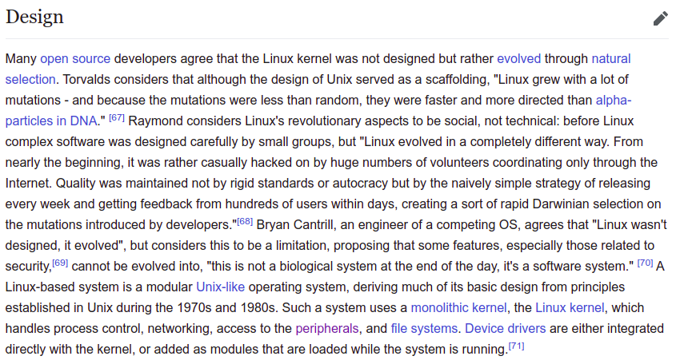

# 26. Open-source
Created Monday 05 April 2021

#### Context

* I was reading about pack-files from <https://www.kernel.org>. It suddenly occurred to me that Linux, was made by volunteers who wanted to use and make *free* software.
* *"But things not made by corporations **would** be very low quality and not stress tested."* - **my flawed reasoning.**
* Reality - But Linux is used around the world - in embedded devices, servers, clusters, supercomputers - all of which are "crirtical" systems.

#### Toxic Assumptions
This "thinking" exposed a lot of toxic assumptions in me:

1. **Normal people can't make good software** - This is really stupid of me. [There are no "miracle" people](https://youtu.be/IIDLcaQVMqw). Corporations exist because of people, not the other way around.
2. **Free software is small and meant for personal use, not for enterprise** - I don't know why I had this idea. Maybe, because I was never *ambitious* enough to make large systems, because of low confidence. Examples of large scale free software - Linux, Apache Hadoop, Apache Lucene, NginX, see more [Apache Projects](https://en.wikipedia.org/wiki/List_of_Apache_Software_Foundation_projects). Read [The Cathedral and the Bazaar, by Eric Raymond](http://www.catb.org/~esr/writings/cathedral-bazaar/).
3. **Free software is not efficient** - this is another lie. If the programmers are the same, the software will be the same. In fact, Free software is better because the programmer *wants* to solve the problem.
4. **Free software is slow to make** - this one is true in a way, but reality is different. Linux is more "social" then it is "technical", In fact, Linux was not "designed", it "evolved". Read the Design part of the Wikipedia Page. Here's a picture.

5. **There's less** **focus(Fear of forking)** - Yes, this is a splitting of a community, and is a nice to have option. [See this](./26._Open-source/Paper 21 - Forks impacts and motivations in free and open source projects.pdf)

#### What to do now?
Well, it would be great if we can simply remove such thoughts. The simplest criteria in place is using the R clause of the [HRF](./24._HRF_-_three_params.md). It increases learning in a good way.

#### Ambition - how is this related?
Well the whole problem is simply - non-participation. It can be due to low confidence, fear, social imposition of ideas. Not being ambitious leads to non-participation, which is simply a recipie for poverty and pain. Simply said, ambition is a necessity for success in anything.

#### Advantages of being ambitious

* Innovation
* Happiness
* Accountability by the user, customer, reciever.

#### Disadvantages

* Nothing actually, assuming you're not hypocritical.

#### Conclusion

* Think big, no matter what.
* Avoid non-participation in anything, mentally or otherwise. 
* You don't have to participate, but know that the option is always open.
* Keep learning.

